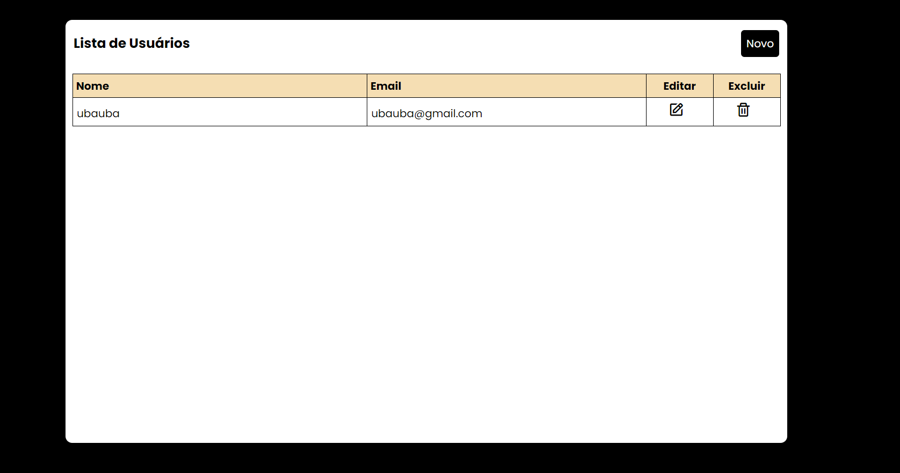
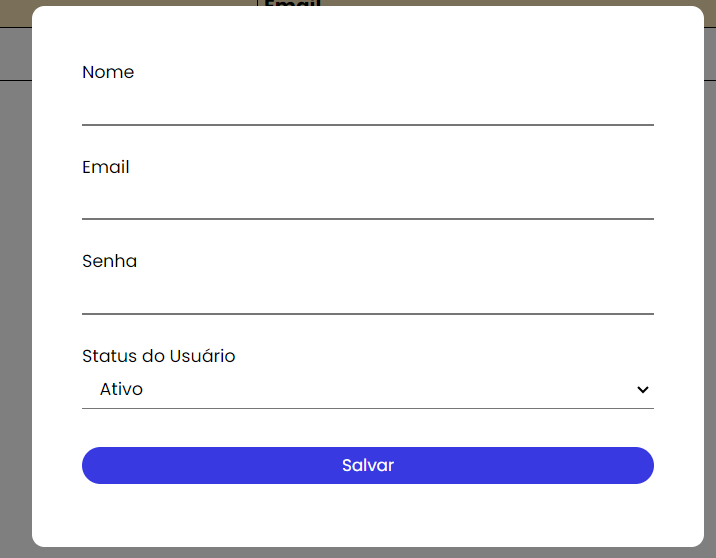

<h1 align="center"> Crud Básico </h1>

Desafio técnico do IATECAM  

  <a href="#-tecnologias">Tecnologias</a>&nbsp;&nbsp;&nbsp;|&nbsp;&nbsp;&nbsp;
  <a href="#-projeto">Projeto</a>&nbsp;&nbsp;&nbsp;

 

  

  

## 🚀 Tecnologias

Esse projeto foi desenvolvido com as seguintes tecnologias:

- HTML e CSS
- JavaScript
- Git e Github

## 💻 Projeto

Uma tela onde podemos visualizar uma lista de usuários
cadastrados no sistema, com as opções de editar e excluir usuários.

E uma janela modal que aparece quando se clica no botão "Novo", para se incluir
informações na lista de usuários

- [Acesse o projeto finalizado, online](https://antonyydy.github.io/crud-basico)

